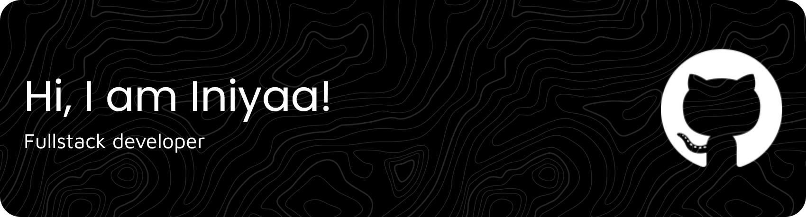

  I'm a CS student from India who loves building things with code and exploring the world of web development. 
  Currently learning by experimenting, breaking things, and getting out of tutorial hell one day at a time!
    
  
  ## What I’m Currently Up To  
 Working on Vyntrix, a subscription tracker API where I’m designing secure auth flows, role-based authorization, and production-style REST endpoints!
    

## Tech Stack

  <h3>Languages</h3>

  

  <h3>Frontend Development</h3>

  

  <h3>Backend and Databases</h3>

  

  <h3>Tools and Platforms</h3>

  

##  Stats

  

  
